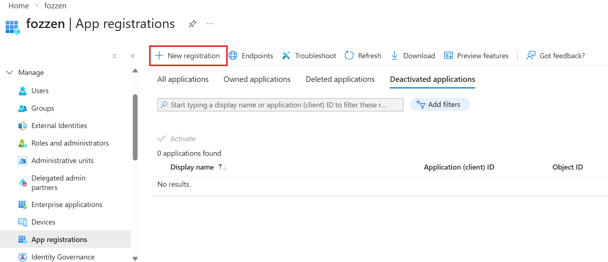
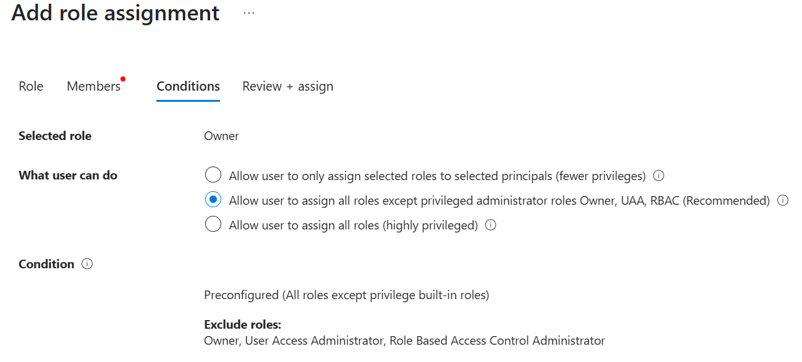
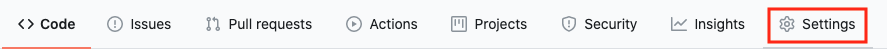
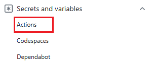
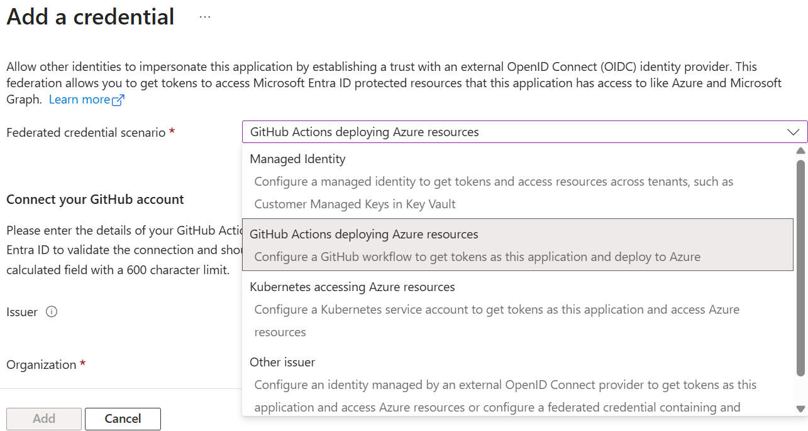
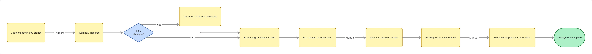
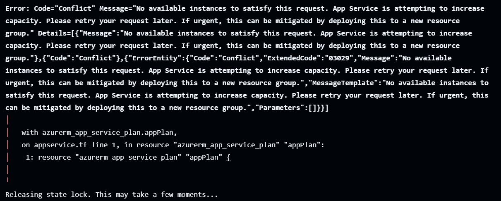
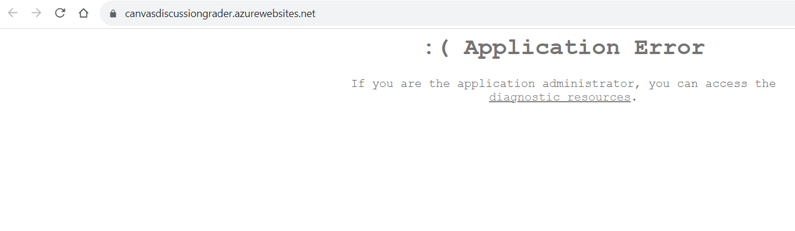

# Overview
This repo contains the infrastructure neccecary for a react & .NET web application with a ephemeral environment use case.

It is built in Azure and uses Terraform & GitHub actions as the IaC tools.
# Architecture Summary

The Ephemeral Environment creates a new environment with all azure resources & deploys the image created to the azure web services for each pull request that is targeted to the dev branch.

The Azure components are:
- Azure App Services
- Azure App Plan
- Azure Log Analytics
- Azure Application Insights
- Azure Container Registry
- Azure Key Vault
- Azure Storage Container
# Infrastructure As Code (IaC)
Terraform is the IaC tool used
locals.tf is used for naming of all azure resources

variables.tf is used for location, tags & environment(dev,test,prod & pr"ID")

Assumption is that the dev, test & prod resource groups already exist due to being created by landing zone via CAF(Cloud Adoption Framework) - https://learn.microsoft.com/en-us/azure/cloud-adoption-framework/

The Terraform state is handled in its own resource group outside this dev,test & prod environment. It exists in a RG-Management resource group in a storage account.

init-backend.yaml & bootstrap-backend.sh runs to set up the state handling for this solution.

Deployment is set up to run automatically for pull requests into dev (for each feature branch ephemeral environment), as well as for each push into dev. 

For infra setup & deployment into test & prod environment, the deployment is manual only.
# CI CD Pipeline
There are 7 GitHub Actions workflow setup for this solution
### 1. Bootstrap Terraform Backend
One time manual run to dev,test & prod environment to setup the state configuration for each environment. ONLY RG needs to exist (with access)

### 2. Terraform Plan & Apply
Can run manually on each environment (dev, test & prod) or runs each time a terraform file is changed and pushed to dev.

1. terraform init
2. terraform plan
3. terraform apply

### 3. Container Build & Deploy
Can run manually on each environment (dev, test & prod) or runs on every dev branch change.

1. Docker build
2. Terraform init(read only to get azure resource names)
3. docker push to container registry
4. deploy to azure web services

### 4. Terraform Destroy
Optionally there exists a workflow to destroy the environment to clean up. Runs only manually and can run on each environment(dev, test & prod)

1. Terraform init
2. Terraform plan
3. Terraform destroy

### 5. Terraform Pull Request Plan & Apply
This is the terraform creation workflow for the ephemeral environment. Runs only on pull requests targeting the dev branch.

Runs a bootstrap-pr.sh first with auth to azure, which sets up a container in the management-RG to set up state configuration for the environment

1. Runs terraform init
2. Terraform plan
3. Terraform apply, using the PR number as the "environment"

### 6. Container Pull request Build & Deploy
This is the container build & deploy workflow for the ephemeral environment. Runs on completion of the "Terraform Pull Request Plan & Apply" workflow.

1. Builds an image based on the commit sha of the previous workflow it triggered on
2. Runs terraform 
3. Pushes the image to the container registry within the environment
4. deploy to azure web services

### 7. Cleanup PR Terraform Backend
This is the automatic destroy workflow for the ephemeral environment. runs when the pull request is closed(merged or pull request manually closed)

1. Terraform init
2. Terraform plan
3. Terraform destroy, using the PR number as the "environment"

# Secrets & Configuration Management
The service principal running the GitHub Actions workflows authenticates to GitHub using federated credentials with both configuration to branches, pull request and environment.

There are 3 secrets needed to log into Azure via federated credentials which are stored in the GitHub repository:

1. AZURE_CLIENT_ID
2. AZURE_TENANT_ID
3. AZURE_SUBSCRIPTION_ID

All other application specific secrets are to be stored in the Azure Key Vault

# Identity & Access
There exists 1 Service principal with subscription level Owner access(not allowed to give privileged roles)

[Register a Microsoft Entra app and create a service principal](https://learn.microsoft.com/en-us/entra/identity-platform/howto-create-service-principal-portal)

[Authenticate to Azure from GitHub Actions workflows](https://learn.microsoft.com/en-us/azure/developer/github/connect-from-azure)

[Use the Azure Login action with OpenID Connect](https://learn.microsoft.com/en-us/azure/developer/github/connect-from-azure-openid-connect)

- AZURE_CLIENT_ID
- AZURE_TENANT_ID
- AZURE_SUBSCRIPTION_ID

[Configure a user-assigned managed identity to trust an external identity provider](https://learn.microsoft.com/en-us/entra/workload-id/workload-identity-federation-create-trust-user-assigned-managed-identity?pivots=identity-wif-mi-methods-azp)

The reason why the service principal needs subscription wide owner access is because it needs to create ephemeral environments and set up AcrPull role for the managed identity in the azure app services.

For a non-ephemeral environment, only contributor access to each resource group is needed (dev, test & production). And adding AcrPull to identity is manual.

# Repo Structure
### .github/Terraform/prod
Contains the terraform code for the dev, test and production environments

### .github/Terraform/pr
Contains the terraform code for the ephemeral environment

The only differences are that it creates a new resource group(instead of using data) and it has a role assignment to setup automatic AcrPull for the managed identity in azure app services

### .github/workflow
Contains the CI/CD pipelines / github actions workflow
### reactapp.client
Frontend of react application
### reactapp.Server
Backend of react application
# Deployment & Data Flow
Data flow for the Ephemeral Environment

1. Create Feature branch
2. Pull Request into dev branch
3. PR Triggers workflow
4. Workflow runs terraform & creates ephemeral environment
5. Workflow triggers new workflow
6. Workflow builds image, deploys to container registry & pushes to web app in ephemeral environment
7. Test & Validate Manually
8. Merge/Close Pull Request triggers workflow
9. Terraform destroy ephemeral environment

Start of production pipeline:

10. Code change in dev branch triggers workflow
11. (OPTIONAL) Workflow runs terraform & creates/updates azure resources (if they dont already exist) (only for infra changes)
12. Workflow builds image, deploys to container registry & pushes to web app in dev environment
13. Manual Pull request from dev branch to test branch
14. Manual workflow dispatch for test environment
15. Manual Pull request from test branch to main branch
16. Manual workflow dispatch for production environment with approval gates
# Troubleshooting
### Terraform GitHub Actions workflow "No available instances to satisfy this request"

This error is due to the current region not having enough avaliable app services.

To fix, run all failed jobs again after 10 minutes.

### Application Error

To check logs go to App Service->Deployment->deployment center->logs

Usually the issue is with the Docker Image. Check AcrPull permission(especially for the non-ephemeral environments) otherwise check the Dockerfile or container build steps

### Error Resource group not found
Error in GitHub actions workflow
Check if resource group exists in the current subscription AND check if the service principal has the correct permission for the correct scope
### fedcred example
environment example

